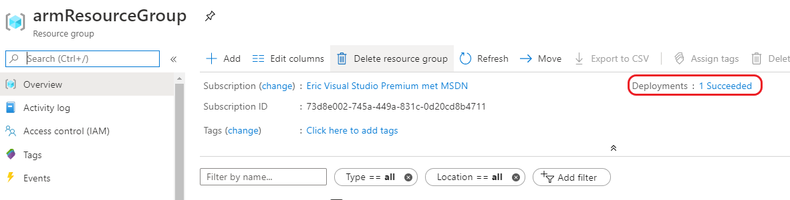
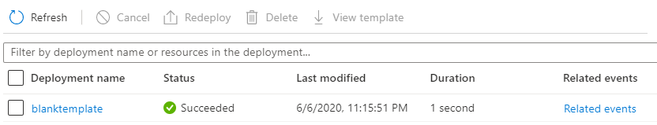
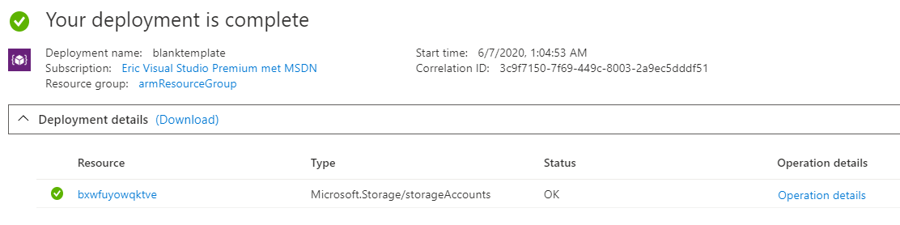
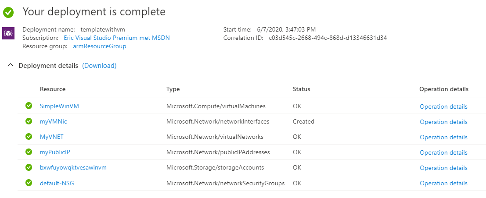
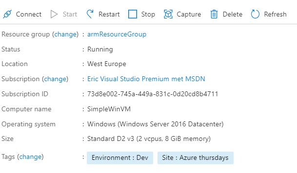
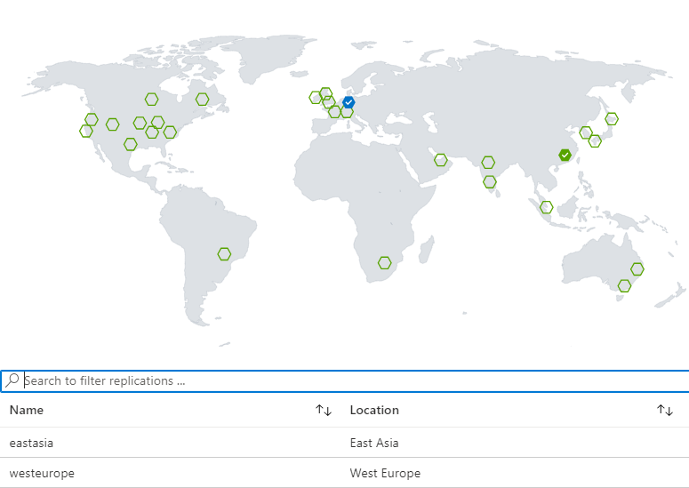

= Azure Thursdays
Eric Schipper <eric.schipper@devoteam.com>
:listing-caption: Listing
:toc:

== Introduction

Welcome to the first Azure Thursdays session for AZ-204! Throughout this session I will be using Visual Studio Code. 
Apart from that, I have the following items installed:

[square]
* Azure Resource Manager (ARM) Tools Extension for Visual Studio Code. This is useful for Intellisense and syntax highlighting. You can install those from the extensions menu.
* Azure Powershell Cmdlets. You can install the commandlets in powershell with this command: `Install-Module -Name Az -AllowClobber -Scope CurrentUser`

== ARM Templates
=== My first ARM template
We're going to deploy some ARM templates. We'll have to connect to azure.

In the Terminal window (Ctrl - `) of VS code and type the following:
[source, PowerShell]
----
Connect-AzAccount
----
This will bring up a login window. You can log in with your azure credentials.

Now we will need a resource group. You could do that in the Azure Portal, but this could also be done with the following line of PowerShell:
[source, PowerShell]
----
New-AzResourceGroup `
  -Name armResourceGroup `
  -Location "West Europe"
----

You should see a response similar to this:
....
ResourceGroupName : armResourceGroup
Location          : westeurope
ProvisioningState : Succeeded
Tags              :
ResourceId        : /subscriptions/73d8e002-745a-449a-831c-0d20cd8b4711/resourceGroups/armResourceGroup
....

We will first create the most basic template possible:

. Create a new file in VS Code and name it `azurethursday.json`.
. Paste the following snippet into the file:

.Create a basic ARM template 
[source, json]
----
{
  "$schema": "https://schema.management.azure.com/schemas/2019-04-01/deploymentTemplate.json#",
  "contentVersion": "1.0.0.0",
  "resources": []
}
----

Now let's deploy this template. Execute the following PowerShell:

[source, powershell]
----
$templateFile = "azurethursday.json"
New-AzResourceGroupDeployment `
  -Name blanktemplate `
  -ResourceGroupName armResourceGroup `
  -TemplateFile $templateFile

----

You should see something like this:
....
DeploymentName          : blanktemplate
ResourceGroupName       : armResourceGroup
ProvisioningState       : Succeeded
Timestamp               : 6/6/2020 9:15:51 PM
Mode                    : Incremental
TemplateLink            :
Parameters              :
Outputs                 :
DeploymentDebugLogLevel :
....

Even though there were no resources specified in the template, it still counts as a deployment. To see this, log in to the Azure Portal.
Navigate to the resource group you made earlier (armResourceGroup). In the top-right corner there's a link `Deployments`

If you click on `blanktemplate` you'll see details about the deployment. This might be useful later on.

=== Making use of a function in the ARM template

Most resources need a storage account to be deployed onto. Resources are usualy referenced by a URL that contains the storage account. Therefore, a storage account must have a globally unique name. The set of allowed characters is also quite limited: they can only consist out of numbers and lowercase letters. So even a GUID of something else like the resource group is not going to work.

One of the things you can do is to make use of the function `unique_string`. This is a *deterministic* hash-like function, so it will always give the same output for a certain input. It will give a string of 13 characters long, containing only numbers and lowercase letters.

[source,json]
----
{
    "$schema": "https://schema.management.azure.com/schemas/2019-04-01/deploymentTemplate.json#",
    "contentVersion": "1.0.0.0",
    "variables": {
       "uniqueStorageName": "[uniqueString(resourceGroup().id)]"
    },
    "resources": [
    {
      "type": "Microsoft.Storage/storageAccounts",
      "apiVersion": "2019-04-01",
      "name": "[variables('uniqueStorageName')]",
      "location": "West Europe",
      "sku": {
        "name": "Standard_LRS"
      },
      "kind": "StorageV2",
      "properties": {
        "supportsHttpsTrafficOnly": true
      }
    }        
    ]
}
----
In this example, a semi-unique string will be made from the resourcegroup id. There is still a chance that this is not globally unique, so you can prefix it with some string value if you like.
We also put that in a variable, so we could use that further down the template, instead of having to calculate the value every time.

Now deploy the template again, using the same command as before:
[source, powershell]
----
$templateFile = "azurethursday.json"
New-AzResourceGroupDeployment `
  -Name withstorageaccount `
  -ResourceGroupName armResourceGroup `
  -TemplateFile $templateFile

----

Again, watch for an output similar to this:
....
DeploymentName          : withstorageaccount
ResourceGroupName       : armResourceGroup
ProvisioningState       : Succeeded
Timestamp               : 6/6/2020 11:05:19 PM
Mode                    : Incremental
TemplateLink            :
Parameters              : 
Outputs                 :
DeploymentDebugLogLevel :
....

Also, if you want to check the deployment in the Azure Portal, you'll see that a storage account was created:

=== Parameters and outputs
Now imagine we have an Azure environment with lots of resources and we need to be able to see instantly what the purpose of the storage account is, just by looking at its name. We could do this with a prefix. One way is to use the concat function and concatenate the name with the prefix specified in the template. This is exactly what we're going to do next, with one addition: we'll make a parameter for that, so we can reuse the template.
Note that you can give a default value if you want. But to show how it's done, see the following command:

[source, json]
----
{
    "$schema": "https://schema.management.azure.com/schemas/2019-04-01/deploymentTemplate.json#",
    "contentVersion": "1.0.0.0",
    "parameters": {
      "namePrefix": {
        "type": "string",
        "defaultValue": "sa"
      }
    },
    "variables": {
       "uniqueStorageName": "[concat(parameters('namePrefix'), uniqueString(resourceGroup().id))]"
    },
    "resources": [
      {
        "type": "Microsoft.Storage/storageAccounts",
        "apiVersion": "2019-04-01",
        "name": "[variables('uniqueStorageName')]",
        "location": "West Europe",
        "sku": {
          "name": "Standard_LRS"
        },
        "kind": "StorageV2",
        "properties": {
          "supportsHttpsTrafficOnly": true
        }
      }
    ],
    "outputs": {
      "properties": {
        "type": "object",
        "value": "[reference(variables('uniqueStorageName'))]"
      }
    }
}
----
In this example, the parameter `namePrefix` is of type string. It is possible to put constraints to these (`minLength`, `maxLength`, `allowedValues` for enumeration-like behaviour). Other datatypes are `securestring`, `int`, `bool`, `object`, `secureObject` and `array`.

We also added an outputs property. This gives info on the created resource. Note the 'reference' function. It gets the object with the specified name.

Deploy the template again:

[source, powershell]
----
$templateFile = "azurethursday.json"
New-AzResourceGroupDeployment `
  -Name templatewithprefix `
  -ResourceGroupName armResourceGroup `
  -TemplateFile $templateFile `
  -namePrefix "azthur"
----

The output now contains a complete description of the storage account:
....
DeploymentName          : templatewithprefix
ResourceGroupName       : armResourceGroup
ProvisioningState       : Succeeded
Timestamp               : 6/7/2020 9:24:54 AM
Mode                    : Incremental
TemplateLink            :
Parameters              :
                          Name             Type                       Value     
                          ===============  =========================  ==========
                          namePrefix       String                     azthur

Outputs                 :
                          Name             Type                       Value
                          ===============  =========================  ==========
                          properties       Object                     {
                            "networkAcls": {
                              "bypass": "AzureServices",
                              "virtualNetworkRules": [],
                              "ipRules": [],
                              "defaultAction": "Allow"
                            },
                            "supportsHttpsTrafficOnly": true,
                            "encryption": {
                              "services": {
                                "file": {
                                  "enabled": true,
                                  "lastEnabledTime": "2020-06-07T09:20:15.7692589Z"
                                },
                                "blob": {
                                  "enabled": true,
                                  "lastEnabledTime": "2020-06-07T09:20:15.7692589Z"
                                }
                              },
                              "keySource": "Microsoft.Storage"
                            },
                            "accessTier": "Hot",
                            "provisioningState": "Succeeded",
                            "creationTime": "2020-06-07T09:20:15.6754841Z",
                            "primaryEndpoints": {
                              "dfs": "https://azthurbxwfuyowqktve.dfs.core.windows.net/",
                              "web": "https://azthurbxwfuyowqktve.z6.web.core.windows.net/",
                              "blob": "https://azthurbxwfuyowqktve.blob.core.windows.net/",
                              "queue": "https://azthurbxwfuyowqktve.queue.core.windows.net/",
                              "table": "https://azthurbxwfuyowqktve.table.core.windows.net/",
                              "file": "https://azthurbxwfuyowqktve.file.core.windows.net/"
                            },
                            "primaryLocation": "westeurope",
                            "statusOfPrimary": "available"
                          }

DeploymentDebugLogLevel : 
....

Note: If this is too verbose, you could choose to output only the `primaryEndpoints` property, by changing the output line in the template to 
[source, json]
----
 "value": "[reference(variables('uniqueStorageName')).primaryEndpoints]"
----

In that case the output properties object will be limited to:
....
                          properties       Object                     {
                            "dfs": "https://azthurbxwfuyowqktve.dfs.core.windows.net/",
                            "web": "https://azthurbxwfuyowqktve.z6.web.core.windows.net/",
                            "blob": "https://azthurbxwfuyowqktve.blob.core.windows.net/",
                            "queue": "https://azthurbxwfuyowqktve.queue.core.windows.net/",
                            "table": "https://azthurbxwfuyowqktve.table.core.windows.net/",
                            "file": "https://azthurbxwfuyowqktve.file.core.windows.net/"
                          }
....

=== Deploying a VM with a template
Now that we've covered the basics of ARM templating, it is time to move on to a more useful type of deployment.
For a VM to run properly, it needs a couple of resources, such as a virtual network, a network interface, etc. These templates get verbose quickly, so we will use a quickstart template out of the box:

https://raw.githubusercontent.com/Azure/azure-quickstart-templates/master/101-vm-simple-windows/azuredeploy.json

It should be noted that some of the resources in this template have a dependency to other resources. For example, the virtual machine depends on the network interface. To specify this relationship, the `dependsOn` property is used.

Also note that this template has some parameters we that can be passed:

[square]
* adminUsername
* adminPassword
* dnsLabelPrefix
* windowsOSVersion (default : 2016-Datacenter)
* vmSize (default : Standard_D2_v3)
* location (default : same as storage account)

For the URL, a unique name must be specified

[source, powershell]
----
$dnsLabelPrefix = "youruniquename"
$templateFile = "azurethursday.json"
$securePassword = convertto-securestring "azthurP@ssw0rd123!" -asplaintext -force
New-AzResourceGroupDeployment `
  -Name templatewithvm `
  -ResourceGroupName armResourceGroup `
  -TemplateFile $templateFile `
  -adminUsername "azthuradmin" `
  -adminPassword $securePassword `
  -dnsLabelPrefix $dnsLabelPrefix
----

Output should be like:
....
DeploymentName          : templatewithvm
ResourceGroupName       : armResourceGroup
ProvisioningState       : Succeeded
Timestamp               : 6/7/2020 1:48:43 PM
Mode                    : Incremental
TemplateLink            :
Parameters              :
                          Name                Type                       Value
                          ==================  =========================  ==========
                          adminPassword       SecureString
                          dnsLabelPrefix      String                     youruniquename
                          windowsOSVersion    String                     2016-Datacenter
                          vmSize              String                     Standard_D2_v3
                          location            String                     westeurope

Outputs                 :
                          Name             Type                       Value
                          ===============  =========================  ==========
                          hostname         String                     youruniquename.westeurope.cloudapp.azure.com

DeploymentDebugLogLevel :
....

In the Azure portal, you could verify the deployment:

By now, it should be possible now to connect to the VM using the credentials specified earlier to the template. In order to do that, you'll need to open a remote desktop connection to the hostname specified by the output of the last command. (in the example it is: youruniquename.westeurope.cloudapp.azure.com )

Note: it's perfectly safe to execute the command one more time. Nothing will happen actually, because the resource with the name specified already exists and it has the same specs. You can think of it as a 'create or update' command. It will, however, update the 'last modified column' in the deployments section, even though nothing happened.

=== Installing extensions on the virtual machine
So now we have deployed a virtual machine and its dependencies. In this section we will install the IIS extension on the virtual machine. For the non-microsoft people, IIS stands for Internet Information Services, and is the standard web server of Microsoft. We will also set up a static 'homepage'.

in the template, add the following resource:

[source, json]
----
   {
      "type": "Microsoft.Compute/virtualMachines/extensions",
      "apiVersion": "2019-12-01",
      "name": "[concat(variables('vmName'),'/', 'InstallWebServer')]",
      "location": "[parameters('location')]",
      "dependsOn": [
          "[concat('Microsoft.Compute/virtualMachines/',variables('vmName'))]"
      ],
      "properties": {
          "publisher": "Microsoft.Compute",
          "type": "CustomScriptExtension",
          "typeHandlerVersion": "1.7",
          "autoUpgradeMinorVersion":true,
          "settings": {
            "commandToExecute": "powershell.exe Install-WindowsFeature -name Web-Server -IncludeManagementTools && powershell.exe remove-item 'C:\\inetpub\\wwwroot\\iisstart.htm' && powershell.exe Add-Content -Path 'C:\\inetpub\\wwwroot\\iisstart.htm' -Value $('Hello World from ' + $env:computername)"
          }
      }
    }    
----
We must also allow http traffic for this machine.
To do that, find the `securityRules` section and add an extra rule next to the existing default-allow-3389 (which is used for the Remote Desktop Connection)

[source, json]
----
          {
            "name": "AllowHTTPInBound",
            "properties": {
              "priority": 1010,
              "access": "Allow",
              "direction": "Inbound",
              "destinationPortRange": "80",
              "protocol": "Tcp",
              "sourcePortRange": "*",
              "sourceAddressPrefix": "*",
              "destinationAddressPrefix": "*"
            }
          }
----

Now, deploy the template again.
IIS will be installed, and when you browse it, a simple message will appear.

In this example, we've used inline statements in the commandToExecute. It is also possible to specify a file from a repository to be executed. 

=== Parameter files and tagging
As the list of parameters grows, it might be useful to specify the parameters in a file. This will keep your PowerShell commands cleaner and you might be storing the parameter file in a repository.
Also, until now we've skipped the more complex object types. It's much easier to handle these also within parameter files. One of these objects is the Tags property, which can be specified for many resource types. 
First, we'll add a tags parameter, with some obscure default values:

[source, json]
----
    "deploymentTags": {
        "type": "object",
        "defaultValue": {
            "Environment": "Test",
            "Site": "AWS Mondays"
        }
    }
----
and for the each resource we'll use that property with the following line (so it is added ):

"tags": "[parameters('deploymentTags')]",

Create a file named azurethursdaywebsite.parameters.dev.json with the following content:

[source, json]
----
{
    "$schema": "https://schema.management.azure.com/schemas/2019-04-01/deploymentParameters.json#",
    "contentVersion": "1.0.0.0",
    "parameters": {
      "adminUsername": {
        "value": "azthuradmin"
      },
      "dnsLabelPrefix": {
        "value": "mustbeuniquewutwut"
      },
      "windowsOSVersion": {
        "value": "2016-Datacenter"
      },
      "vmSize": {
        "value": "Standard_D2_v3"
      },
      "deploymentTags": {
        "value": {
          "Environment": "Dev",
          "Site": "Azure thursdays"
        }
      }
    }
}
----

Run the following Powershell command:

$templateFile = "azurethursday.json"
$securePassword = convertto-securestring "azthurP@ssw0rd123!" -asplaintext -force
$parameterFile = "azurethursdaywebsite.parameters.dev.json"
New-AzResourceGroupDeployment `
  -Name templatewithtaggedvm `
  -ResourceGroupName armResourceGroup `
  -TemplateFile $templateFile `
  -TemplateParameterFile $parameterFile `
  -adminPassword $securePassword `

In Azure Portal, navigate to your VM (SimpleWinVM) and verify that the tags are present. 
Now click on one of the two tags. It should bring you to a list of all resources with that tag, which can be convenient.

== Docker containers in Azure

=== Create an ACR 
We will be using the azure CLI for these steps.
Go to the azure portal and click on the CLI button in the top right:

Ensure that Powershell mode is selected and type the following command:

----
az group create -n rg-acr-azthur -l westeurope
----

Now create the ACR (you'll have to invent a unique name yourself. alphanumeric between 5-50):
----
$REGISTRY_NAME=youruniquename
az acr create -n $REGISTRY_NAME -g rg-acr-azthur -l westeurope --sku Premium
----

Note that we're creating a Premium registry here. It's a bit more expensive, but it has extra features. One of these is geo replication, which will be shown below. Just make sure to delete it after you're done :)
The following command will create a geo-replication in east asia:

----
az acr replication create -r acrazthur -l eastasia
----

When this is finished, visit the azure portal and navigate to container registries. Choose the registry you just created and click on 'Replications'. Verify that the replication is set up correctly:

=== Creating an image
The following part borrowed from microsoft docs. We will create a very basic docker image. 

In the Azure CLI, switch from Powershell to Bash mode. 
Type 'code' and hit enter.

A new subwindow will appear, and type in the following content:

----
FROM    node:9-alpine
ADD     https://raw.githubusercontent.com/Azure-Samples/acr-build-helloworld-node/master/package.json /
ADD     https://raw.githubusercontent.com/Azure-Samples/acr-build-helloworld-node/master/server.js /
RUN     npm install
EXPOSE  80
CMD     ["node", "server.js"]
----

Press ctrl-s, and name the file Dockerfile
This file will be saved on a drive which is attached to your azure cli environment. It's made the first time you enter a cli session. A separate resource group and storage account are made automatically.
Of course this is not meant as a production drive, but when for experimenting this is fine, because the contents will also be kept, if you close the session.

Since we switched to Bash, we need to set the variable again:

----
REGISTRY_NAME=youruniquename
----

run the following command in the CLI:

----
az acr build --registry $REGISTRY_NAME --image helloacrtasks:v1 .
----

in about 30 seconds, the image is created: among other things, the feedback you get should be similar to the following:

....
- image:
    registry: acrazthur.azurecr.io
    repository: helloacrtasks
    tag: v1
    digest: sha256:dda5063bea3be4d070d9c065a1725d2098b580968d41c5cc32e1f9c6dc7da93e
  runtime-dependency:
    registry: registry.hub.docker.com
    repository: library/node
    tag: 9-alpine
    digest: sha256:8dafc0968fb4d62834d9b826d85a8feecc69bd72cd51723c62c7db67c6dec6fa
  git: {}
....

Verify in the portal that a repository was created (under menu repositories), and verify that te image was created in the corresponding repository (acrtasks). It should be named v1.
Or, in the CLI: 
----
az acr repository list --name $REGISTRY_NAME --output table
----

== Deploying a container
Next, we're going to deploy a container. Right now we will be taking a shortcut, by providing the admin credentials. Again, this is for testing purposes only. In a production environment it is recommended to diasble the admin account and only use role-based access with Azure Active Directory identities. That is for a future Azure thursday session.

Execute the following commands
----
az acr update -n $REGISTRY_NAME --admin-enabled true
az acr credential show --name $REGISTRY_NAME
----

Among the output are credentials of the admin account. Copy and paste those in the following command:

----
az container create \
    --resource-group rg-acr-azthur \
    --name acr-azthur \
    --image $REGISTRY_NAME.azurecr.io/helloacrtasks:v1 \
    --registry-login-server $REGISTRY_NAME.azurecr.io \
    --ip-address Public \
    --location WestEurope \
    --registry-username [username] \
    --registry-password [password]
----

If everything went well you should be able to see the container in the portal, when you navigate to container instances.
Now you could see the IP address in the top right of that screen, but if you want to be cool you can enter this command in the CLI:

----
az container show --resource-group  rg-acr-azthur --name acr-azthur --query ipAddress.ip --output table
----

And now for the final part: paste that address into a browser, and verify that the container is running properly!

